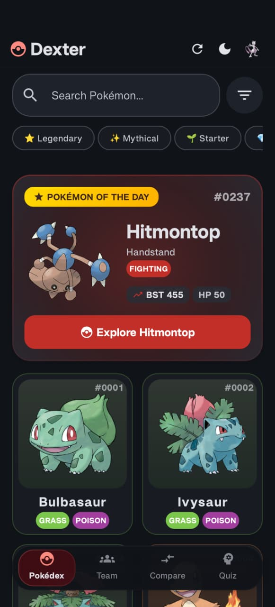
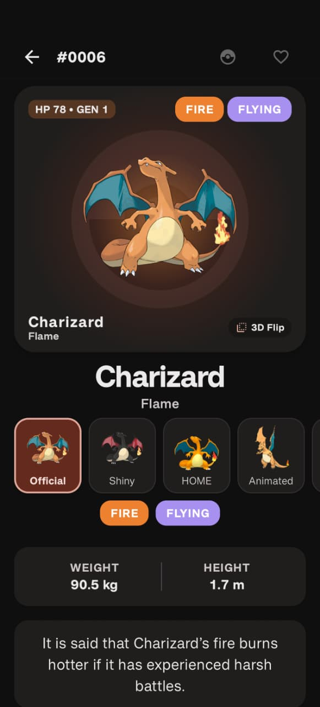
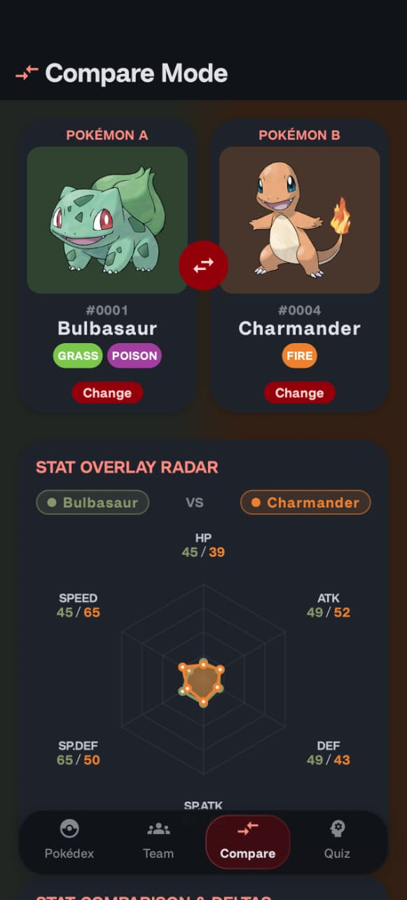
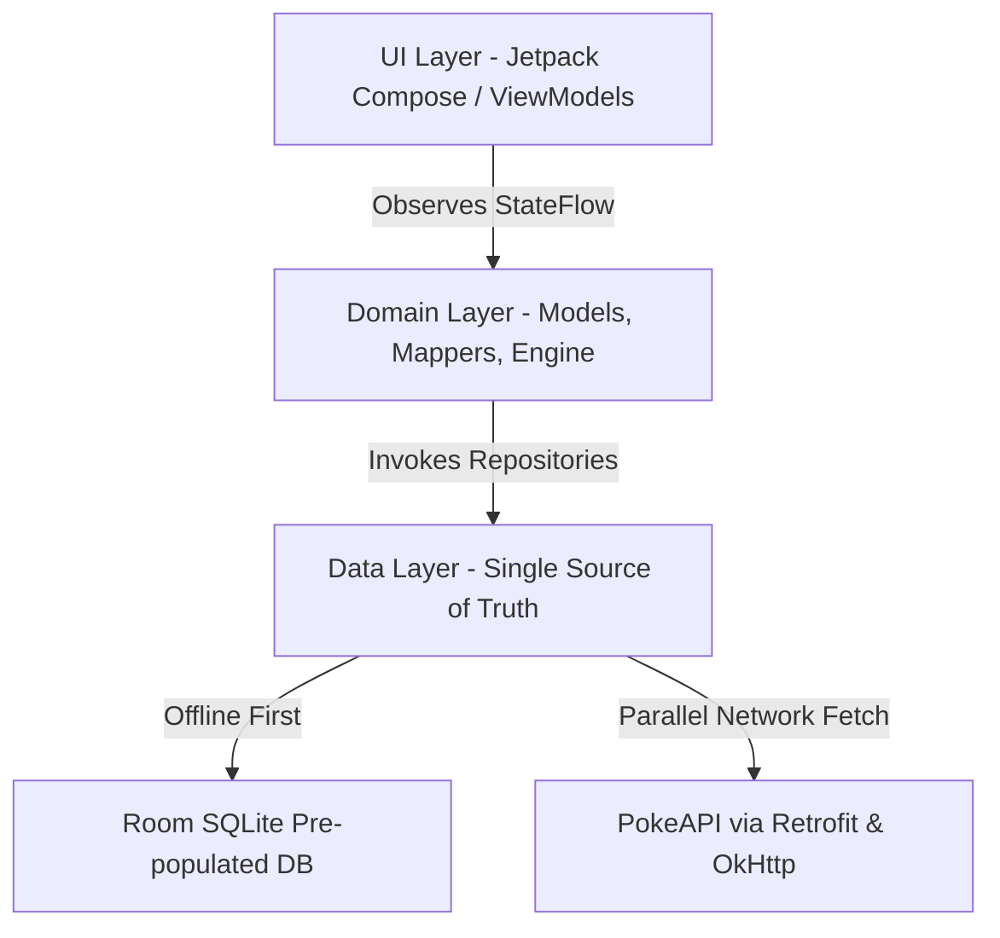

# 🔴 Dexter — Modern Pokédex for Android

[](https://developer.android.com/)
[](https://kotlinlang.org/)
[](https://developer.android.com/jetpack/compose)
[]()
[]()
[](LICENSE)

**Dexter** is a high-performance, feature-packed, offline-first Pokédex application for Android crafted with modern Android development practices: **Jetpack Compose**, **Clean Architecture**, **Room Database**, **Hilt**, **Coroutines / Flow**, and **Parallel Async Pipeline**.

---

## 📸 Screenshots

| **Pokédex Home & Discovery** | **Pokémon Details & 3D Card** | **Side-by-Side Compare Mode** |
| :---: | :---: | :---: |
|  |  |  |
| *Featured Pokémon of the Day, quick category filters, and 120 FPS grid* | *3D flip card, official/shiny/animated form switcher, and height/weight* | *Dual Pokémon battle comparison and real-time stat overlay radar* |

---

## ✨ Key Features & Highlights

- ⚡ **High-Performance 120 FPS Grid Scrolling**
  - Off-main-thread search, multi-criteria filtering, and sorting computed on `Dispatchers.Default` across 1,000+ Pokémon.
  - Optimized thumbnail memory decoding (`.size(256)`) with Coil memory and disk caching for stutter-free list scrolling.

- 🚀 **30x Faster Pokémon Detail Loading**
  - Parallel coroutine engine (`async` / `awaitAll`) that fetches up to 30 move and ability details concurrently.
  - Instant UI display from Room DB with reactive background detail streaming.

- 🔍 **Comprehensive Pokédex Search & Multi-Filter**
  - Instant client-side search by name or Pokédex number.
  - Multi-criteria filtering by Generation (Gen I–IX), Element Types, and Special Categories (Legendary / Mythical / Ultra Beasts).

- 📱 **Adaptive Split-Pane & Live Inspector**
  - Dual-pane layout on tablets and expanded screens featuring a Live Pokémon Inspector Pane alongside the Pokédex list.

- 📊 **Rich Pokémon Details & 3D Trading Card**
  - Interactive 3D card flip with stat displays and TCG card integration.
  - Complete evolution chain visualizer and regional form previews (Alolan, Galarian, Hisuian, Paldean).

- 🛡️ **Type Matchup Matrix**
  - Automated calculation of weakness (2x, 4x), resistance (0.5x, 0.25x), and immunity (0x) for dual-type Pokémon.

- ⚔️ **6-Pokémon Team Builder**
  - Roster manager with team synergy analysis identifying weakness overlaps and type coverage.

- ⚖️ **Side-by-Side Compare Mode**
  - Direct stats, height, weight, and type advantage comparisons between any two Pokémon.

- 🎵 **"Who's That Pokémon?" Audio & Visual Quiz**
  - $O(1)$ constant-time distractor picker for instant question transitions.
  - Authentic cry audio player (`QuizAudioPlayer`), waveform visualizer, silhouette guessing, and score tracking.

- 🏆 **Scrollable Trainer Profile & Achievements Engine**
  - Full-screen scrollable statistics layout tracking caught count, quiz streak, achievements, and app theme preferences.

---

## 🛠️ Architecture & Tech Stack

The app adheres to **Android Clean Architecture** guidelines with **MVVM (Model-View-ViewModel)** and Unidirectional Data Flow (UDF).



### Core Technologies

| Layer | Technology |
| :--- | :--- |
| **Language** | [Kotlin](https://kotlinlang.org/) (100%) |
| **UI Framework** | [Jetpack Compose](https://developer.android.com/jetpack/compose) with Material 3 |
| **Dependency Injection** | [Hilt / Dagger](https://dagger.dev/hilt/) |
| **Local Database** | [Room Database](https://developer.android.com/training/data-storage/room) with pre-populated SQLite asset (`dexter_database.db`) |
| **Networking** | [Retrofit 2](https://square.github.io/retrofit/) & [OkHttp 4](https://square.github.io/okhttp/) |
| **Concurrency & Reactive** | Kotlin [Coroutines](https://kotlinlang.org/docs/coroutines-overview.html), `async` / `awaitAll`, & [StateFlow](https://kotlinlang.org/api/kotlinx.coroutines/kotlinx-coroutines-core/kotlinx.coroutines.flow/-state-flow/) |
| **Navigation** | Jetpack Compose Navigation (`DexterNavHost`) |
| **Testing** | JUnit 4, Kotlinx Coroutines Test |

---

## 📁 Project Structure

```text
com.dexter.app/
├── data/
│   ├── local/          # Room Entities (Pokemon, TeamMember, QuizScore, Achievement), DAOs, & DexterDatabase
│   ├── remote/         # PokeApi DTOs & Retrofit Service interface
│   └── repository/     # PokemonRepository, ThemePreferencesRepository, TrainerPreferencesRepository
├── di/                 # Hilt Modules (DatabaseModule, NetworkModule, RepositoryModule)
├── domain/
│   ├── engine/         # AchievementEngine business logic
│   ├── mapper/         # DTO / Entity to Domain Mappers
│   └── model/          # Core Domain Models (Pokemon, PokemonType, PokemonVariant, SpecialCategory)
├── navigation/         # Screen routes & DexterNavHost graph
├── ui/
│   ├── achievements/   # Achievements Screen & ViewModel
│   ├── adapters/       # RecyclerView Adapters
│   ├── common/         # Reusable UI components (StatBar, TypeChip, SearchFilterBar, BottomSheets)
│   ├── compare/        # Compare Screen & ViewModel
│   ├── detail/         # Detail Screen, EvolutionTree, Moves, TypeMatchup, Interactive3DTradingCard
│   ├── filter/         # Filter Screen & BottomSheet
│   ├── home/           # Pokédex Grid Home Screen, InspectorPane, & ViewModel
│   ├── profile/        # Trainer Profile Screen & ViewModel
│   ├── quiz/           # Audio Quiz Screen, Audio Player & ViewModel
│   ├── team/           # Team Builder Screen & ViewModel
│   └── theme/          # TypeThemingEngine, Color, Type, Theme, Dimens
└── util/               # FlowUtils extensions & HapticUtils
```

---

## 🚀 Getting Started

### Prerequisites

- **Android Studio**: Ladybug (2024.2.1) or newer
- **JDK**: Version 17+
- **Min SDK**: API Level 26 (Android 8.0 Oreo)
- **Target SDK**: API Level 34 (Android 14)

### Building & Running

1. **Clone the repository**:
   ```bash
   git clone https://github.com/your-username/pokedex.git
   cd pokedex
   ```

2. **Build Debug APK**:
   ```bash
   ./gradlew assembleDebug
   ```

3. **Install to connected device via ADB**:
   ```bash
   adb install -r app/build/outputs/apk/debug/app-debug.apk
   ```

---

## 📜 License

This project is licensed under the MIT License - see the [LICENSE](LICENSE) file for details.

---

## 🙏 Acknowledgements & Disclaimers

- Pokémon data provided by [PokeAPI](https://pokeapi.co/).
- Pokémon character names are trademarks of Nintendo, Game Freak, and The Pokémon Company. This application is an unofficial fan-made project developed for educational purposes.
