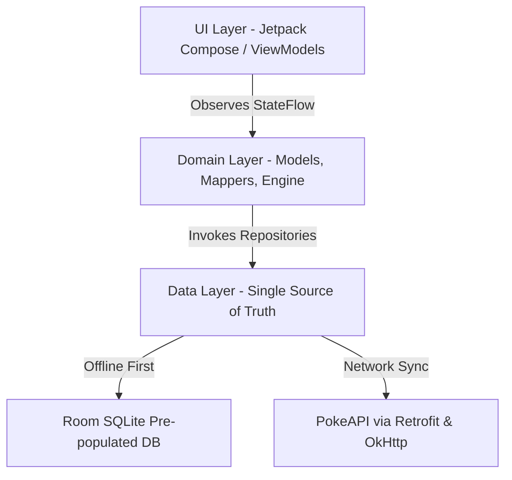

# 🔴 Dexter — Modern Pokédex for Android

[](https://developer.android.com/)
[](https://kotlinlang.org/)
[](https://developer.android.com/jetpack/compose)
[]()
[](LICENSE)

**Dexter** is a feature-packed, offline-first Pokédex application for Android crafted with modern Android development practices, **Jetpack Compose**, **Clean Architecture**, **Room Database**, **Hilt**, and **Coroutines / Flow**.

---

## ✨ Features

- 🔍 **Comprehensive Pokédex Search & Filtering**
  - Instant client-side search by name or Pokédex number.
  - Multi-criteria filtering by Generation (Gen I–IX), Element Types, and Special Categories (Legendary / Mythical / Ultra Beasts).

- 📊 **Rich Pokémon Details**
  - Animated base stat bars with color-coded scale (HP, Attack, Defense, Sp. Atk, Sp. Def, Speed).
  - Complete evolution chain visualizer.
  - Comprehensive moveset list, hidden abilities, height, weight, and catch rate.
  - Variant Strip for Mega Evolutions, Gigantamax, and Regional Forms (Alolan, Galarian, Hisuian, Paldean).

- 🛡️ **Type Matchup Matrix**
  - Automated calculation of weakness (2x, 4x), resistance (0.5x, 0.25x), and immunity (0x) for dual-type Pokémon.

- ⚔️ **6-Pokémon Team Builder**
  - Build custom 6-Pokémon battle rosters.
  - Instant team synergy analysis identifying weakness overlaps and missing coverage.

- ⚖️ **Side-by-Side Compare Mode**
  - Directly compare stats, heights, weights, and type advantages between any two Pokémon.

- 🎵 **"Who's That Pokémon?" Audio & Visual Quiz**
  - Interactive mini-game featuring authentic cry sound effects via `QuizAudioPlayer`.
  - Silhouette-based guessing modes with scoring and streak tracking.

- 🏆 **Trainer Profile & Achievements Engine**
  - Track caught Pokémon progress and trainer level.
  - Dynamic achievement system that rewards catching milestones, team composition, and quiz streaks.

- 🎨 **Dynamic Type-Based Theming Engine**
  - Contextual UI theming system (`TypeThemingEngine`) that dynamically shifts primary/secondary color palettes based on the selected Pokémon's element type.

---

## 🛠️ Architecture & Tech Stack

The app adheres to **Android Clean Architecture** guidelines with **MVVM (Model-View-ViewModel)** and Unidirectional Data Flow (UDF).



### Core Technologies

| Layer | Technology |
| :--- | :--- |
| **Language** | [Kotlin](https://kotlinlang.org/) (100%) |
| **UI Framework** | [Jetpack Compose](https://developer.android.com/jetpack/compose) with Material 3 |
| **Dependency Injection** | [Hilt / Dagger](https://dagger.dev/hilt/) |
| **Local Database** | [Room Database](https://developer.android.com/training/data-storage/room) with pre-populated SQLite asset (`dexter_database.db`) |
| **Networking** | [Retrofit 2](https://square.github.io/retrofit/) & [OkHttp 4](https://square.github.io/okhttp/) |
| **Concurrency & Reactive** | Kotlin [Coroutines](https://kotlinlang.org/docs/coroutines-overview.html) & [StateFlow](https://kotlinlang.org/api/kotlinx.coroutines/kotlinx-coroutines-core/kotlinx.coroutines.flow/-state-flow/) |
| **Navigation** | Jetpack Compose Navigation (`DexterNavHost`) |
| **Testing** | JUnit 4, Kotlinx Coroutines Test |

---

## 📁 Project Structure

```text
com.dexter.app/
├── data/
│   ├── local/          # Room Entities (Pokemon, TeamMember, QuizScore, Achievement), DAOs, & DexterDatabase
│   ├── remote/         # PokeApi DTOs & Retrofit Service interface
│   └── repository/     # PokemonRepository, ThemePreferencesRepository, TrainerPreferencesRepository
├── di/                 # Hilt Modules (DatabaseModule, NetworkModule, RepositoryModule)
├── domain/
│   ├── engine/         # AchievementEngine business logic
│   ├── mapper/         # DTO / Entity to Domain Mappers
│   └── model/          # Core Domain Models (Pokemon, PokemonType, PokemonVariant, SpecialCategory)
├── navigation/         # Screen routes & DexterNavHost graph
├── ui/
│   ├── achievements/   # Achievements Screen & ViewModel
│   ├── adapters/       # RecyclerView Adapters (PokemonListAdapter, TeamMemberAdapter)
│   ├── common/         # Reusable UI components (StatBar, TypeChip, SearchFilterBar, BottomSheets)
│   ├── compare/        # Compare Screen & ViewModel
│   ├── detail/         # Detail Screen, EvolutionTree, Moves, TypeMatchup, VariantStrip
│   ├── filter/         # Filter Screen & BottomSheet
│   ├── home/           # Pokédex Grid Home Screen & ViewModel
│   ├── profile/        # Trainer Profile Screen & ViewModel
│   ├── quiz/           # Audio Quiz Screen, Audio Player & ViewModel
│   ├── team/           # Team Builder Screen & ViewModel
│   └── theme/          # TypeThemingEngine, Color, Type, Theme, Dimens
└── util/               # FlowUtils extensions & HapticUtils
```

---

## 🚀 Getting Started

### Prerequisites

- **Android Studio**: Ladybug (2024.2.1) or newer
- **JDK**: Version 17+
- **Min SDK**: API Level 26 (Android 8.0 Oreo)
- **Target SDK**: API Level 34 (Android 14)

### Building & Running

1. **Clone the repository**:
   ```bash
   git clone https://github.com/your-username/pokedex.git
   cd pokedex
   ```

2. **Open in Android Studio**:
   - Open Android Studio and select `Open an existing project`.
   - Select the cloned `pokedex` folder.

3. **Build the project**:
   ```bash
   ./gradlew assembleDebug
   ```

4. **Run Unit Tests**:
   ```bash
   ./gradlew test
   ```

---

## 📜 License

This project is licensed under the MIT License - see the [LICENSE](LICENSE) file for details.

---

## 🙏 Acknowledgements & Disclaimers

- Pokémon data provided by [PokeAPI](https://pokeapi.co/).
- Pokémon and Pokémon character names are trademarks of Nintendo, Game Freak, and The Pokémon Company. This application is an unofficial fan-made project developed for educational and portfolio purposes.
